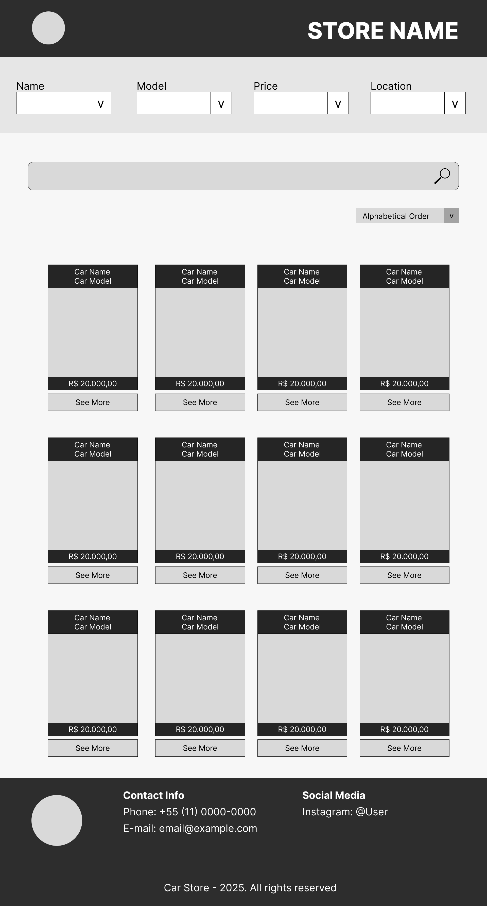

# Buscador de Carros

[link para site](https://imoutofbounds.github.io/Buscador-de-Carros/)

1. Se você fosse lançar esse buscador no mercado, qual seria seu modelo de negócios?
Eu seguiria um plano parecido com o mercado livre, permitindo que pessoas possam anunciar seus veículos ou negociar a compra com outros usuários. A monetização viria por meio de uma taxa de inscrição para os vendedores, com cada anúncio gerando uma comissão, a qual seria um percentual do valor anunciado do veículo.

2. Como você atrairia seus primeiros usuários? (Estratégia de aquisição, canais, etc)
Por meio de anuncios na internet e televisão.

3. Qual seria sua estimativa de CAC (Custo de Aquisição de Cliente)?

4. Qual seria sua proposta de LTV (Lifetime Value) e como você maximizaria isso?

5. Que tipo de monetização você considera viável para essa aplicação?

6. Há alguma estratégia de retenção de usuários que você aplicaria?

## Mockup do projeto

